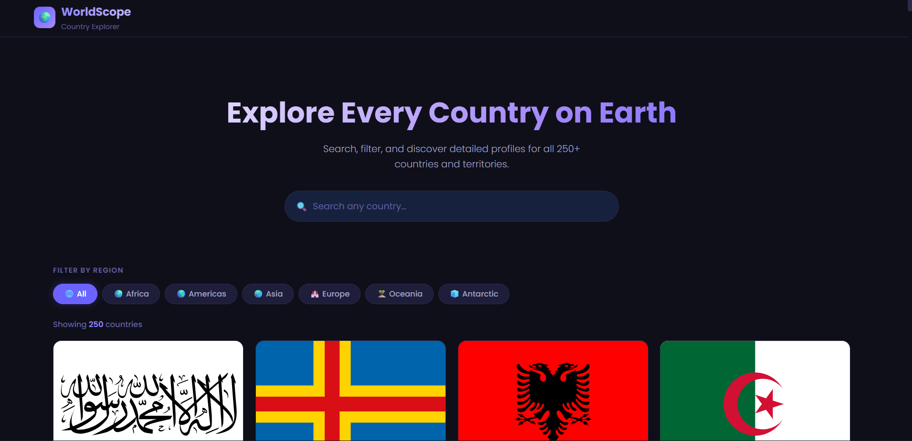

# 🌍 WorldScope — Country Explorer

A sleek, modern country explorer app that lets you search and explore every country in the world. Get detailed info including flags, population, currencies, languages, borders and more — all in a beautiful dark UI.

---

## 🚀 Live Demo

👉 [View Live](https://minajuddin0510.github.io/country-explorer/)

---

## 📸 Preview



---

## ✨ Features

- 🔍 **Real-time Search** — Results update instantly as you type
- 🗺️ **Filter by Region** — Africa, Americas, Asia, Europe, Oceania, Antarctic
- 🃏 **Country Cards** — Flag, name, capital, region and population at a glance
- 📋 **Detailed Country View** — Deep dive into any country's full data
- 🔗 **Clickable Border Countries** — Explore neighboring countries instantly
- ⚡ **Instant Filtering** — Data cached after first load, no repeated API calls
- 📱 **Fully Responsive** — 4 column desktop, 2 column tablet, 1 column mobile
- 🌀 **Smooth Animations** — Fade-in cards, slide-in detail view
- 🔢 **Country Counter** — Shows how many countries are currently displayed
- 🔥 **Zero Dependencies** — Pure vanilla JavaScript only

---

## 📊 Data Shown Per Country

| Field | Description |
|-------|-------------|
| 🚩 Flag | Official country flag (SVG) |
| 🏷️ Name | Common name & official name |
| 🏙️ Capital | Capital city |
| 🌐 Region & Subregion | Geographic classification |
| 👥 Population | Formatted with commas |
| 📐 Area | In km², formatted with commas |
| 💰 Currency | Name and symbol |
| 🗣️ Languages | All official languages |
| 🕐 Timezones | All timezones |
| 📞 Calling Code | International dial code |
| 🌐 Top Level Domain | Country TLD (.in, .us etc.) |
| 🗺️ Border Countries | Clickable chips to explore neighbors |

---

## 🛠️ Tech Stack

| Technology | Usage |
|------------|-------|
| HTML5 | Structure |
| CSS3 | Dark UI, Grid Layout, Animations |
| JavaScript (Vanilla) | Logic, API calls, DOM manipulation |
| RestCountries API v3.1 | All country data |
| CSS Grid | Responsive card layout |
| CSS Transitions | Smooth animations |

---

## 🌐 API Used

This project uses the **RestCountries API** — completely free, no API key required.

```
Search by name:   https://restcountries.com/v3.1/name/{COUNTRY}
All countries:    https://restcountries.com/v3.1/all
Filter by region: https://restcountries.com/v3.1/region/{REGION}
By country code:  https://restcountries.com/v3.1/alpha/{CODE}
```

> 📌 No API key. No sign-up. Completely free.

---

## 🧠 How It Works

```
App loads → fetches all countries once → caches in memory
        ↓
User searches or filters → instant results from cache
        ↓
User clicks a country card → detail view slides in
        ↓
Border country chips fetched by country code
        ↓
Clicking a border chip → loads that country's detail view
```

---

## ⚙️ How to Run Locally

1. **Clone the repository**
```bash
git clone https://github.com/minajuddin0510/country-explorer.git
```

2. **Navigate into the folder**
```bash
cd country-explorer
```

3. **Open in browser**
```bash
# Just open index.html in any modern browser
# Or use VS Code Live Server extension
```

No installation. No build steps. No dependencies. Just open and explore. ✅

---

## 📁 Project Structure

```
country-explorer/
│
├── index.html        # Complete app — HTML + CSS + JS in one file
├── preview.png       # App preview screenshot
└── README.md         # Project documentation
```

---

## 🙋‍♂️ Author

**Minaj Uddin**

- 🌐 GitHub: [@minajuddin0510](https://github.com/minajuddin0510)
- 💼 Founder of [CraftSite Studio](https://github.com/minajuddin0510)

> This is a hobby project built to strengthen my web development skills and GitHub portfolio.

---

## 📄 License

This project is open source and available under the [MIT License](LICENSE).

---

## 🌟 Show Your Support

If you found this useful, drop a ⭐ on GitHub — it really means a lot!

---

_Built with ❤️ by Minaj Uddin_